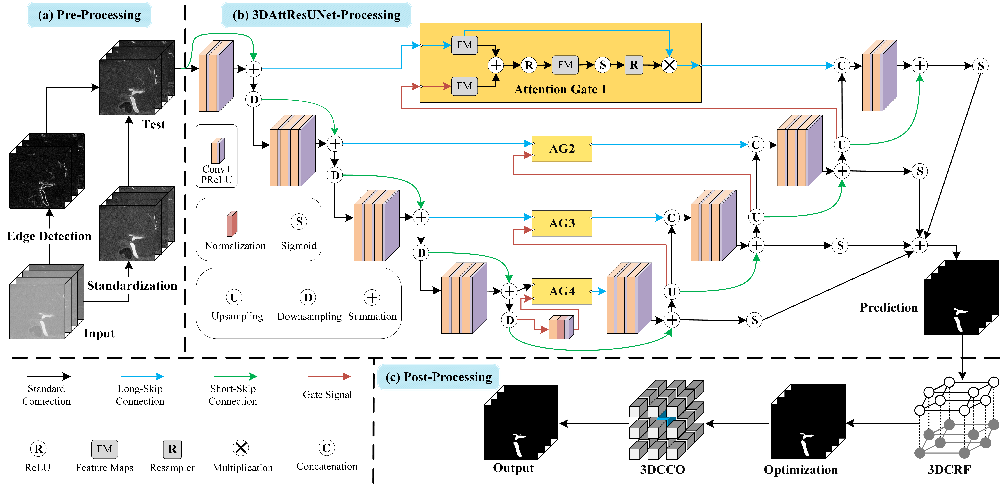
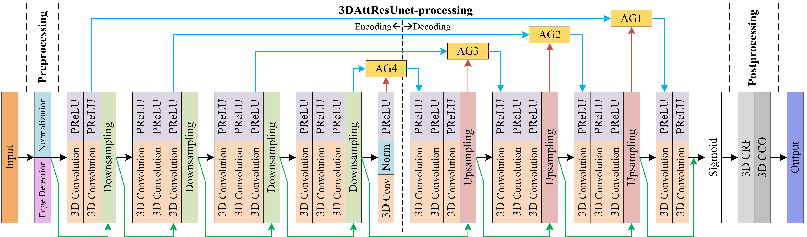
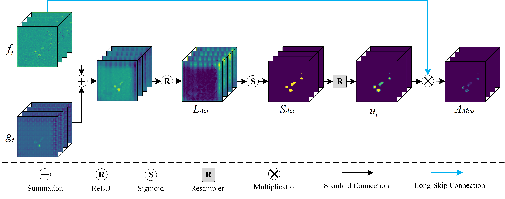
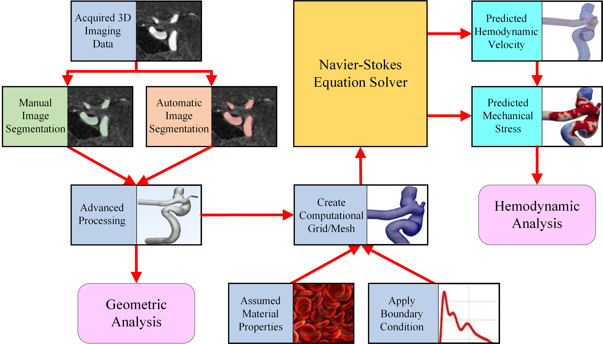

# An attention residual u-net with differential preprocessing and geometric postprocessing: Learning how to segment vasculature including intracranial aneurysms

```
@article{mu2023attention,
  title={An attention residual u-net with differential preprocessing and geometric postprocessing: Learning how to segment vasculature including intracranial aneurysms},
  author={Mu, Nan and Lyu, Zonghan and Rezaeitaleshmahalleh, Mostafa and Tang, Jinshan and Jiang, Jingfeng},
  journal={Medical Image Analysis},
  volume={84},
  pages={102697},
  year={2023},
  publisher={Elsevier}
}
```


## Usage

### 0. Dependencies
Some core dependencies:

- torch == 1.11.0
- [pydensecrf](https://github.com/lucasb-eyer/pydensecrf) == 1.0rc2 # for performing Fully-Connected CRFs 

More details can be found in <./requirements.txt>

### 1. Data Preparation
* Please follow the instructions for placing the data in `dataset/`, which should be structured as follows:

```
IAData
├── train
|   ├── ct
|   |	├── volume-0.nii.gz
|   |   └── volume-1.nii.gz
|   |   ...
|   |   └── volume-14.nii.gz
|   └── seg
|    	├── segmentation-0.nii.gz
|       └── segmentation-1.nii.gz
|       ...
|       └── segmentation-14.nii.gz
└── test
    ├── ct
    |	├── volume-0.nii.gz
    |   └── volume-1.nii.gz
    |   ...
    |   └── volume-7.nii.gz
    └── seg
     	├── segmentation-0.nii.gz
        └── segmentation-1.nii.gz
        ...
        └── segmentation-7.nii.gz
```

* Set the paths to the training set, testing set and trained model in `parameter.py`

* Test the validity of maximum and minimum thresholds for training data using `data_analysis/get_threshold.py` 

```
python data_analysis/get_threshold.py
```

* Crop the 3D data for the training and testing sets using `data_prepare/get_training_set.py` and `data_prepare/get_testing_set.py` respectively

```
python data_prepare/get_training_set.py
```
```
python data_prepare/get_testing_set.py
```

### 2. Training

* Run `train.py` to start the training

```
python train.py
```

### 3. Testing
* Run `test.py` to start the testing

```
python test.py
```

### 4. Optimization
* Run `denseCRF/3D-CRF.py` to perform CRF post-processing

```
python denseCRF/3D-CRF.py
```


## Paper Details

### Method Detials







### Comparison


### Simulation




## Cite
If you find our code useful for your research, please cite our paper:

N. Mu, Z. Lyu, M. Rezaeitaleshmahalleh, J. Tang, and J. Jiang, "An attention residual u-net with differential preprocessing and geometric postprocessing: Learning how to segment vasculature including intracranial aneurysms", Medical Image Analysis, vol. 84, 2023.

In case of any questions, please contact the corresponding author J. Jiang at jjiang1@mtu.edu